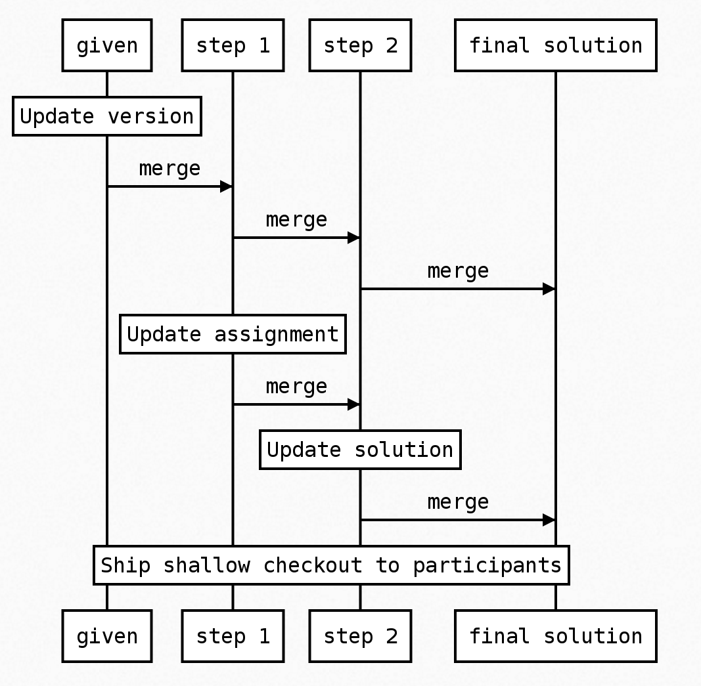

Easily manage course material consisting of multiple phases that build on each
other

# Context

Maintaining the 'given' and 'solution' code for a workshop/course is a challenge, especially
if there are a number of exercises where each exercise builds on the previous.

The main initial goals of this experiment are to:

* Make it easy for participants to check out the 'starting point' for each exercise
* Make it easy to share the solution to the exercise
* Make it easy to maintain the course code, for example introducing new best practices or upgrading versions

Additionally, this approach introduces some opportunities for other nice features:

* Make it easy for participants to compare their solutions, between each other and to the given solution
* Check the health of each 'step' in the course using some kind of build tool

Even further into the future:

* Based on a 'master' repo like this, for a given specific iteration of the workshop/course we could
generate a repo specifically for this course
* We could host this repo ourself (spinning up an image on AWS or similar), and have fine-grained
control over e.g. when we allow access to the solutions, and some nice UI features.

# Proposal

The general approach is to have one branch (this one) containing metadata about the workshop/course,
and a branch for each starting point and/or example solution in the course.

Each branch should be a valid project that can be checked (by CI or a local tool such as sbt). From the 'metadata branch' we could
verify broader invariants, such as validating each 'starting point' is a git parent of each 'example solution' in the course.

When doing maintenance on the course, you could start by making the change on the 'earliest' branch where
the change is desired, and then merge it into all later steps.

For shipping code to clients, we could create a shallow checkout of the repository that only contains the latest version of each step.

# Example

For example, you can easily see the difference between the solutions and the excercises:

  https://github.com/raboof/scala-labs/compare/given...raboof:basic02

And a bit of maintenance on the given code:

  https://github.com/raboof/scala-labs/commit/4f7eda2e95c7d5bfc0ac20bafa098423cb70985b

Could simply be merged in to the solution branch:

  https://github.com/raboof/scala-labs/commit/f33ec69175c3b5161a5a10024eab4235a56a2240
